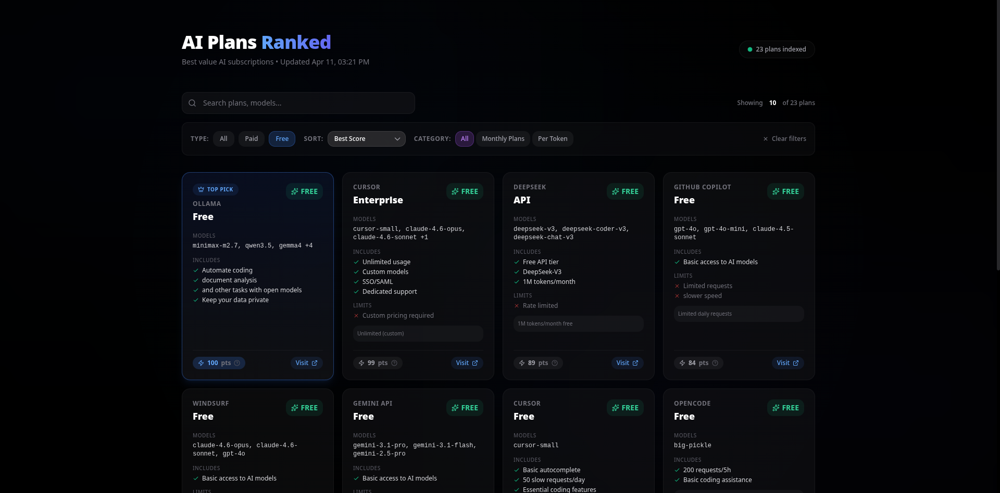

# Ai Rank

> Directorio y comparador de planes de IA para desarrolladores. Encuentra el mejor plan según modelos, precio y limites.



## Tecnologias

**Backend (Scraper)**
- Python 3.10+ | Playwright | BeautifulSoup4 | Ollama (LLM)

**Frontend**
- Next.js 14 | TypeScript | Tailwind CSS | Prisma | SQLite

## Caracteristicas

- Comparacion de **25+ planes** de 13 providers (Cursor, Copilot, Claude, GPT, DeepSeek, y mas)
- **Score de valor** calculado en tiempo real (modelos + precio + limites)
- Filtros por busqueda, tipo (free/paid) y ordenamiento
- Scraper con **Ollama LLM** para extraer datos reales de las paginas
- **Actualizacion diaria** automatica via cron

## Quick Start

```bash
# Web app
cd web
npm install
npx prisma db push
npm run dev

# Scraper
cd scraper
pip install -r requirements.txt
python focalizado.py
```

## Providers Cubiertos

| Global | API / China |
|--------|-------------|
| Cursor, Copilot, Claude, OpenAI, Windsurf, Gemini, OpenCode | DeepSeek, Qwen, MiniMax, GLM, Kimi |

## Deploy

- **Live Demo:** http://ai-rank.sebastianmorales.sbs/
- **Repo:** https://github.com/SebastianMoralesDuque/rank-ai-plan
